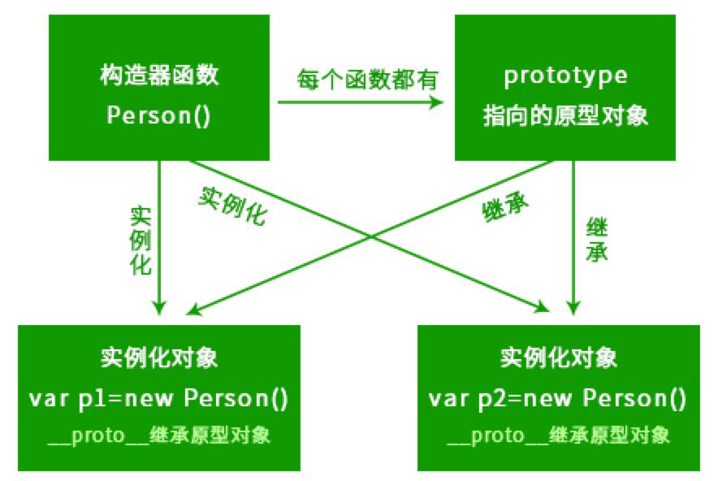

# 原型及原型链

## 基本概念

prototype(只有方法才有，是属性的集合,使您有能力向对象添加属性和方法。)   
_proto_(每个对象都有，指向原型对象的指针，指针链就是原型链)  


## 原型链
// 这就是原型链  
```
Function.prototype.__proto__ ===    Array.prototype.__proto__ === Object.prototype  

Object.prototype._proto_   = null   (终点)
```

## 数组的原型是数组，对象的原型是对象

```
Array.isArray( Array.prototype )

答案：true
解析：Array.prototype是一个数组
数组的原型是数组，对象的原型是对象，函数的原型是函数

```
构造函数

```
constructor（指向构造函数）

Person.prototype.constructor 指向 Person
Object.prototype.constructor 指向 Object
```



形象的比喻「今天投了个懒没学习」
构造函数是妈，原型对象是爸，实例对象是孩子。妈让每个孩子拥有私有能力，爸让它们拥有共有能力（这个共有能力其实都是爸代劳的/(ㄒoㄒ)/~~）；

## 例子


```
//man 对象

function Person(){

}
var man = new Person();
Person.prototype.name='cy'

// 两条原型链
man._proto_    指向   Person.prototype
Person.prototype._proto_   指向  Object.prototype


```


